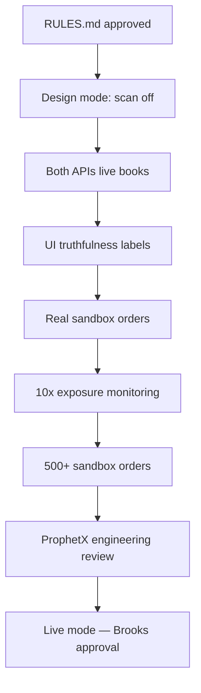

# Tyche Arbitrage Operating Rules

**Authoritative operating rules for the Tyche cross-venue hedge engine.**

This document defines how Tyche **must** run — especially in **sandbox mode** — what algorithms it uses, what data is allowed in the UI, and what ProphetX requires before production access. When this document conflicts with informal chat, **this document wins**.

Related focused docs (linked, not replaced):

- [formulas.md](formulas.md) — quick formula reference
- [risk-and-execution.md](risk-and-execution.md) — leg risk and auto-exec policy
- [prophetx-sandbox.md](prophetx-sandbox.md) — env setup checklist
- [sandbox-bakeoff.md](sandbox-bakeoff.md) — strategy comparison protocol
- [overview.md](overview.md) — high-level product summary

**Changelog**

| Date | Change |
|------|--------|
| 2026-06-26 | Initial rules document. Current mandated mode: **sandbox only**. Live mode blocked. |

---

## 1. Purpose, scope, and authority

### 1.1 What Tyche is

Tyche is Mount Olympus’s **cross-venue hedge / arbitrage** business unit (`tyche-arb` in the ledger). It monitors **Kalshi** and **ProphetX** for **binary two-outcome** markets on the same sporting event. When opposite sides can be purchased for less than a guaranteed $1.00 payout (after fees, slippage, and buffers), the system may execute **both legs automatically** inside strict risk rails.

Tyche is **not** a directional sports-betting model. It does not predict winners. Its voice is **math-only** — no hype, no “guaranteed money” marketing.

### 1.2 What Tyche is not

- A scraper of offshore sportsbooks
- A geolocation or VPN bypass tool
- A system that claims profit without worst-case math passing first
- A live real-money trading system **today** (see §2)

### 1.3 Legal and compliance posture

- **Official APIs only** — Kalshi Trade API, ProphetX Partner Trading API
- No scraping, no unofficial feeds, no credential sharing
- User (Brooks) is responsible for quoted prices on ProphetX (per Anthony’s email)
- Production access requires ProphetX engineering review **after** sandbox proof

### 1.4 Code references

| Area | Path |
|------|------|
| Scan loop | `apps/server/src/tyche/tycheLoop.ts` |
| Bundle math | `apps/server/src/tyche/pricing/bundleCalculator.ts` |
| Matching | `apps/server/src/tyche/matching/rules.ts` |
| Risk | `apps/server/src/tyche/risk/riskEngine.ts` |
| Execution | `apps/server/src/tyche/execution/executor.ts` |
| Config | `apps/server/src/config.ts` |
| Trading desk UI | `apps/client/src/ui/TycheTradingFloor.tsx` |

---

## 2. Operating mode matrix

### 2.1 Current mandated mode: **SANDBOX ONLY**

As of this document:

- **No real money** is deployed on either venue
- Kalshi must use **`KALSHI_ENV=demo`** (demo API, play-money account)
- ProphetX must use **sandbox** (`ss-sandbox.betprophet.co`, `api-ss-sandbox.betprophet.co`)
- **`TYCHE_MODE=live` is BLOCKED** until ProphetX engineering review **and** explicit Brooks approval recorded in this file’s changelog

### 2.2 Mode definitions

| Mode | Real orders | Book data | P&L truth standard | Required UI label |
|------|-------------|-----------|-------------------|-------------------|
| `observe` | No | Live API preferred | Opportunities only; **no P&L claims** | “Scan only” |
| `paper` | No | Live API preferred | **Simulated** fills from live prices | “Paper / SIMULATED” |
| `sandbox` | Yes (test funds) | **Must be live API** | Real fills from venue `order_id`s | “Sandbox — test funds” |
| `live` | Yes (real USD) | Live API | Real fills | **BLOCKED** (see §2.1) |

### 2.3 Mode selection rules

- **Design / UI work:** `TYCHE_AUTO_SCAN=false` — no venue polling, no opportunities presented as live (see §8)
- **Kalshi-only development:** allowed with ProphetX stubbed, but cross-venue opportunities must be labeled `source: mock` and **must not execute**
- **Real cross-venue sandbox testing:** requires both Kalshi demo keys **and** ProphetX sandbox keys with `PROPHETX_ENABLED=true` and `TYCHE_MODE=sandbox`
- **Never** set `TYCHE_MODE=live` without updating this document’s changelog with approval date and production gate checklist

### 2.4 Auto-execution vs approval

Brooks has explicitly required **no per-trade approval**. Trades execute automatically when:

1. `TYCHE_AUTO_EXECUTION=true` (default in config)
2. Mode allows execution (`paper`, `sandbox`, or `live`)
3. Opportunity passes bundle math (§4d)
4. Risk engine allows (§4e)
5. Global kill switch is off

Manual approval is **not** part of the workflow. Risk rails replace human approval.

---

## 3. Core strategy

### 3.1 The hedge (plain language)

On the **same event** (e.g. “Mets win”), buy **opposite sides** on two venues so **exactly one leg pays $1.00 per contract pair**:

| Leg | Venue | Side | Meaning |
|-----|-------|------|---------|
| A | Kalshi | **YES** | Outcome happens |
| B | ProphetX | **NO** | Outcome does not happen |

If total cost (both asks) plus fees and slippage is **less than $1.00**, worst-case profit is locked **before the game starts** — regardless of who wins.

### 3.2 Worked example

| Venue | Side | Ask price |
|-------|------|-----------|
| Kalshi | Mets YES | $0.49 |
| ProphetX | Mets NO | $0.49 |

- **Bundle cost:** $0.49 + $0.49 = **$0.98**
- **Guaranteed payout:** **$1.00** (one leg always wins)
- **Gross edge per contract:** $0.02
- **Net edge:** gross − Kalshi fee − ProphetX fee − slippage buffer (see §4d)

This is real arbitrage logic. Profit exists only when the **books disagree enough** that both sides together cost less than certainty.

### 3.3 What can still go wrong (not “guaranteed money”)

Even when math passes:

- **Leg risk:** one leg fills, the other does not → directional exposure; must unwind
- **Matching error:** contracts are not actually the same event/resolution → one leg may not hedge the other
- **Stale books:** prices moved between scan and order
- **Partial fills:** size less than planned
- **Latency:** live markets move during submission

The system must treat these as first-class failure modes (§4f, §4e).

### 3.4 Strategy filters

Controlled by `TYCHE_STRATEGY`:

| Value | Behavior |
|-------|----------|
| `static_only` | Pre-game / not live only (default) |
| `live_only` | In-play / started events only |
| `combined` | Rank all opportunities by priority score |

Implementation: `passesStrategyFilter()` in `bundleCalculator.ts`.

---

## 4. Algorithms (canonical)

### 4a. Market normalization

**Scope:** binary two-outcome markets only.

All prices normalized to implied probability in **0–1**:

- **Kalshi:** cents → probability (`kalshi/mapper.ts`)
- **ProphetX:** American odds → probability (`prophetx/mapper.ts`)

Each normalized market carries:

- `marketId`, `eventName`, `sport`, `startTime`
- `yesAsk`, `yesBid`, `noAsk`, `noBid` + depths
- `resolutionText`, `overtimeIncluded`, `isLive`
- `fetchedAt` (ISO timestamp — required for freshness checks)

### 4b. Event matching

Implementation: `matching/rules.ts`, `matching/marketMatcher.ts`.

**Hard filters (must all pass for any match):**

1. Same `sport`
2. Event name normalization — strip noise (“to win”, “moneyline”), compare participant keys
3. Start time within **±15 minutes** (`START_TOLERANCE_MS = 15 * 60 * 1000`)
4. Same overtime inclusion rule

**Confidence tiers:**

| Tier | Meaning | Auto-exec allowed? |
|------|---------|-------------------|
| `EXACT_MATCH` | Resolution text matches (or mutual substring) | **Yes** |
| `PROBABLE_MATCH` | Event matches, resolution uncertain | **No** |
| `NOT_MATCH` | Failed hard filters | No |

**Rule:** Semantic or LLM-based match suggestions **never** trigger auto-execution alone. Only deterministic `EXACT_MATCH`.

**Standard leg pairing:**

- Leg A: Kalshi **YES**
- Leg B: ProphetX **NO**

### 4c. Resolution safety

Implementation: `matching/resolutionChecker.ts`.

Block pairs when:

- One market resolves on “advance/qualify” and the other on straight “win”
- Void/cancel rules differ between venues

Blocked pairs are excluded from opportunity detection entirely.

### 4d. Bundle math

Implementation: `pricing/bundleCalculator.ts`, `pricing/fees.ts`.

```
PAYOUT = 1.00  (per paired binary contract)

bundle_cost = kalshi_yes_ask + prophetx_no_ask
gross_edge_per_contract = PAYOUT - bundle_cost

max_size = min(
  kalshi_yes_ask_depth,
  prophetx_no_ask_depth,
  floor(kalshi_balance / kalshi_yes_ask),
  floor(prophetx_balance / prophetx_no_ask),
  floor(TYCHE_MAX_TRADE_USD / max(kalshi_yes_ask, prophetx_no_ask, 0.01))
)

leg_a_notional = kalshi_yes_ask * max_size
leg_b_notional = prophetx_no_ask * max_size

fees = fee_kalshi(leg_a_notional) + fee_prophetx(leg_b_notional)
slippage_buffer = TYCHE_MAX_SLIPPAGE * max_size * 2

net_edge = gross_edge_per_contract * max_size - fees - slippage_buffer
notional = bundle_cost * max_size
worst_case_roi = net_edge / notional   (if notional > 0)
```

**Fee model** (`fees.ts` — verify against live fee schedules before production):

| Venue | Taker rate | Maker rate |
|-------|------------|------------|
| Kalshi | 1.0% | 0.5% |
| ProphetX | 1.0% | 0.5% |

Auto-execution requires `feesKnown()` for both venues.

**Priority score:**

- Static: `net_edge / max(hours_to_settlement, 0.25)`
- Live: `net_edge / max(minutes_to_settlement, 15) / 60` (live events prioritized by shorter horizon)

**Execute gate — ALL must pass:**

| Check | Config key / rule |
|-------|-------------------|
| Match confidence | `EXACT_MATCH` only |
| Strategy filter | passes `TYCHE_STRATEGY` |
| Size | `max_size > 0` |
| Min profit | `net_edge >= TYCHE_MIN_WORST_CASE_PROFIT_USD` |
| Min ROI | `worst_case_roi >= TYCHE_MIN_WORST_CASE_ROI` |
| Fees | known for both venues |
| Risk engine | §4e |

### 4e. Risk engine

Implementation: `risk/riskEngine.ts`, `risk/limits.ts`, `risk/killSwitch.ts`.

**Blocks execution when any of:**

- Global Olympus kill switch ON (`guardrails.ts`)
- Tyche manually paused
- Auto-pause threshold hit (leg failures or daily loss — `killSwitch.ts`)
- `TYCHE_AUTO_EXECUTION=false`
- Not `EXACT_MATCH`
- Opportunity `shouldExecute=false` (any bundle math rejection)
- Stale book: `now - fetchedAt > TYCHE_MAX_ORDERBOOK_AGE_MS` (default **1000 ms**)
- Trade notional exceeds `TYCHE_MAX_TRADE_USD`
- Daily notional would exceed `TYCHE_MAX_DAILY_NOTIONAL_USD`
- Dual balance gate fails: either venue cannot fund its leg at required size
- Sandbox/live mode but ProphetX not configured for cross-venue orders

**Order type:** limit orders only. **Market orders are forbidden.**

**Dual balance gate:**

```
leg_a_required = kalshi_yes_ask * max_size
leg_b_required = prophetx_no_ask * max_size
require: kalshi.availableUsd >= leg_a_required AND prophetx.availableUsd >= leg_b_required
```

### 4f. Execution and leg risk

Implementation: `execution/executor.ts`, `execution/legRiskManager.ts`.

**Submission:**

1. Build both legs at computed `max_size` and limit prices (= current ask at decision time)
2. Submit **simultaneously** when possible (`Promise.all` on both legs)
3. Record trade bundle as `pending` (yellow in UI)

**Outcomes:**

| Result | Bundle status | P&L |
|--------|---------------|-----|
| Both legs filled | `success` (green) | Actual from fills − fees |
| One leg filled, other failed | `failed` (red) | Unwind attempted; do **not** count locked profit |
| Both failed | `failed` (red) | $0 |
| Timeout / partial | `failed` (red) | null until reconciled |

**P&L rule:** `actualPnlUsd` must come from **confirmed fill prices and fees**, never from `worstCaseProfitUsd` / `lockedProfitUsd` alone.

---

## 5. Truthfulness and no-fabrication policy

This section encodes Brooks’s requirement: **sandbox uses no real money, but every number shown must be truthful** — if the desk shows a profit, it must mean “if I had placed these exact orders at these exact prices, this is what would have happened.”

### 5.1 Allowed data sources

| Data | Source | When allowed |
|------|--------|--------------|
| Orderbook prices | Kalshi demo REST / WS | Keys configured, `fetchedAt` recorded |
| Orderbook prices | ProphetX sandbox REST / WS | `PROPHETX_ENABLED=true`, `fetchedAt` recorded |
| Balances | Kalshi `/portfolio/balance` | Demo keys configured |
| Balances | ProphetX `/mm/get_balance` | Sandbox keys configured |
| Trades / fills | Venue order IDs + fill confirmations | Sandbox or live mode only |
| P&L | Sum of actual fill prices − fees − unwind costs | After fill reconciliation |
| Opportunities | Computed from live books at scan time | Books fresh, sources labeled |

### 5.2 Forbidden (never present as live without label)

| Practice | Why forbidden |
|----------|---------------|
| `mockProphetxMarkets()` prices shown as live cross-venue arb | Fabricated 49¢/52¢ spreads |
| Silent fallback to mock Kalshi books on API error | User sees opportunities that never existed |
| Instant-fill skeleton in `placeRealLeg()` counted as sandbox P&L | No real order ID or fill |
| `lockedProfitUsd` reported as realized P&L without fills | Theoretical, not actual |
| Mixing paper/simulated trades into sandbox P&L totals | Contaminates truth |
| `$100,000` placeholder balance when live API balance is available | Misleading account display |
| Mock opportunities in execution blotter | Design-only data in trading view |

Placeholder balances (`SANDBOX_VENUE_BALANCE_USD = 100_000` in `sandboxBalances.ts`) are allowed **only** when API keys are missing **and** UI clearly labels “Placeholder — connect API”.

### 5.3 UI labeling requirements (trading desk)

Every **opportunity row** must show:

- Venue tickers for both legs
- Ask prices (¢), American odds (ProphetX), depth
- Book age (`fetchedAt` → “2s ago”)
- Data source: `live` | `mock` | `simulated`
- Match confidence tier
- `shouldExecute` flag + rejection reasons if false

Every **trade bundle** must show:

- Mode badge: `SANDBOX` | `PAPER` | `SIMULATED`
- Per-leg order ID (when real)
- Status: pending (yellow) / success (green) / failed (red)
- **Actual P&L** only after fill confirmation

**Account bar** must include:

- “Sandbox test funds — not real money” (or equivalent)
- Per-venue balance with source indicator (live read vs placeholder)

### 5.4 Audit trail

All opportunities, risk decisions, and trades are persisted in SQLite (`tyche_opportunities`, `tyche_risk_decisions`, `tyche_trades`, `tyche_trade_legs`, `tyche_balances`). Logs must not claim execution when mode is `observe`.

---

## 6. ProphetX sandbox requirements

See **Appendix A** (engineering-review email) and **Appendix B** (onboarding email) for verbatim text.

### 6.1 Parsed checklist — onboarding (Appendix B)

- [ ] Register: https://ss-sandbox.betprophet.co/register?currency=cash
- [ ] Log in to **sandbox** (not production cash site)
- [ ] Menu → **API Integration** → Generate New Token → save `access_key` + `secret_key`
- [ ] Confirm auth: `POST https://api-ss-sandbox.betprophet.co/partner/auth/login`
- [ ] Email anthony.fradella@prophetexchange.com — account verified, sports/markets of interest
- [ ] Read docs: https://docs.prophetx.co/docs/getting-started and https://docs.prophetx.co/llms.txt

### 6.2 Parsed checklist — engineering review (Appendix A)

**Environment:**

- [ ] Sandbox only — test funds, **not real money**
- [ ] Production (`cash.api.prophetx.co`) is separate approval after review

**Trading behavior:**

- [ ] Trade with **production-realistic sizing and coverage** (not absurd micro-orders unless testing size logic)
- [ ] Build **price sanity checks** before submission
- [ ] Build **kill switch** for max-loss scenarios
- [ ] Trader responsible for quoted prices

**API constraints:**

- [ ] Rate limit: **50 requests/second** max globally
- [ ] Query endpoints (markets, events, odds): **≤ 1 poll per second** — use **WebSocket** for real-time
- [ ] Access tokens expire after **10 minutes** — implement automatic refresh
- [ ] Batch orders: up to **20 wagers** per batch request — prefer batching

**Exposure rules (ProphetX cash balance):**

- [ ] Funds deducted on **fill**, not on order placement
- [ ] **Unmatched stake** (resting open orders) must not exceed **10× cash balance**
- [ ] At **50× cash balance** unmatched exposure, system backs off new submissions — monitor and scale down before hitting limit

See **Appendix D** for “unmatched exposure” definition.

**Volume and uptime (for engineering review):**

- [ ] Target **500+ orders** in sandbox so ProphetX engineering can review activity
- [ ] Run **continuously** — demonstrate reconnect handling, varied market conditions, extended uptime

**Production approval timing:**

- [ ] ProphetX typically does **not** approve new API users Fri–Sun — plan testing Mon–Thu
- [ ] When ready, notify Anthony to kick off engineering review

### 6.3 Clarifications from Brooks / assistant discussions

| Question | Answer |
|----------|--------|
| Is sandbox real money? | **No.** Test funds only. |
| Can sandbox attach real money? | **No.** Production is a separate account and approval. |
| What is “500 trades”? | Volume target for ProphetX **engineering review**, not a profit goal. |
| What is unmatched exposure? | Total stake in **resting/unfilled orders**, not settled positions or matched bets. |
| What is 10× rule? | Unmatched stake ≤ 10× **ProphetX cash balance** (sandbox ≈ $100k → ~$1M cap). |
| What is 50× rule? | At 50× balance in unmatched exposure, ProphetX **throttles** new order submissions. |

---

## 7. Kalshi demo requirements

### 7.1 Environment

| Setting | Sandbox/demo value |
|---------|-------------------|
| `KALSHI_ENV` | `demo` |
| API base | `https://demo-api.kalshi.co/trade-api/v2` |
| Auth | RSA — `KALSHI_API_KEY` (Key ID) + `KALSHI_PRIVATE_KEY_PATH` or inline PEM |

Production Kalshi (`KALSHI_ENV=production`) is **blocked** until ProphetX production gate and explicit Brooks approval.

### 7.2 Demo funds

Kalshi demo account uses **play money**, not real USD. Demo balance must be read from `/portfolio/balance` when keys are configured.

Placeholder `$100,000` (`sandboxBalances.ts`) applies only when keys are missing and must be labeled in UI.

### 7.3 Data requirements

Same truthfulness rules as §5 — demo books are **live demo API data**, not internally generated mock books, when keys are configured and API succeeds.

---

## 8. Scanning and API polling rules

### 8.1 Scan loop

Implementation: `tycheLoop.ts` — default interval `TYCHE_SCAN_INTERVAL_MS=5000`.

**Design mode:** `TYCHE_AUTO_SCAN=false` (default)

- No `setInterval` scan
- No venue API polling
- No opportunities presented as live market data
- Balances may show placeholder for UI design only

**Sandbox scan mode:** `TYCHE_AUTO_SCAN=true`

- Both venues must be explicitly enabled
- ProphetX query rate **must not exceed 1 req/sec** for market/event/odds endpoints (may require throttling below 5s scan interval for ProphetX calls)
- Prefer WebSocket feeds when implemented (Phase 2)

### 8.2 Enable flags

| Flag | Default | Meaning |
|------|---------|---------|
| `TYCHE_AUTO_SCAN` | `false` | Master scan on/off |
| `PROPHETX_ENABLED` | `false` | ProphetX API calls allowed |
| `KALSHI_*` keys | unset | Kalshi uses mock fallback if unset |

When scan is on, **never silently substitute mock books** without UI `source: mock` label and exclusion from auto-execution.

---

## 9. Configuration reference

All Tyche settings from `apps/server/src/config.ts` and `apps/server/.env.example`.

### 9.1 Tyche core

| Variable | Default | Description |
|----------|---------|-------------|
| `TYCHE_AUTO_SCAN` | `false` | Enable background venue scanning |
| `TYCHE_MODE` | `observe` | `observe` \| `paper` \| `sandbox` \| `live` (**live blocked**) |
| `TYCHE_STRATEGY` | `static_only` | `static_only` \| `live_only` \| `combined` |
| `TYCHE_AUTO_EXECUTION` | `true` | Auto-exec when risk passes (no per-trade approval) |
| `TYCHE_MAX_TRADE_USD` | `5` | Max notional per bundle — start tiny; scale per Anthony guidance |
| `TYCHE_MAX_DAILY_NOTIONAL_USD` | `50` | Daily notional cap |
| `TYCHE_MIN_WORST_CASE_PROFIT_USD` | `0.25` | Min net edge ($) to execute |
| `TYCHE_MIN_WORST_CASE_ROI` | `0.01` | Min ROI (1%) to execute |
| `TYCHE_MAX_SLIPPAGE` | `0.005` | Slippage buffer per contract side |
| `TYCHE_MAX_ORDERBOOK_AGE_MS` | `1000` | Max book age at decision time |
| `TYCHE_MAX_LEG_DELAY_MS` | `500` | Max acceptable delay between leg submissions |
| `TYCHE_SCAN_INTERVAL_MS` | `5000` | Scan loop interval (ms) |

### 9.2 Recommended sandbox `.env` (when ready to test)

```env
TYCHE_MODE=sandbox
TYCHE_AUTO_SCAN=true
TYCHE_AUTO_EXECUTION=true
TYCHE_STRATEGY=static_only
TYCHE_MAX_TRADE_USD=5
TYCHE_MAX_DAILY_NOTIONAL_USD=50
PROPHETX_ENABLED=true
PROPHETX_ENV=sandbox
PROPHETX_ACCESS_KEY=...
PROPHETX_SECRET_KEY=...
KALSHI_ENV=demo
KALSHI_API_KEY=...
KALSHI_PRIVATE_KEY_PATH=secrets/kalshi-demo.pem
```

### 9.3 Kalshi

| Variable | Default | Description |
|----------|---------|-------------|
| `KALSHI_ENV` | `demo` | `demo` \| `production` |
| `KALSHI_API_KEY` | — | Key ID (UUID) |
| `KALSHI_PRIVATE_KEY_PATH` | — | Path to `.pem` private key |
| `KALSHI_PRIVATE_KEY` | — | Inline PEM alternative |

### 9.4 ProphetX

| Variable | Default | Description |
|----------|---------|-------------|
| `PROPHETX_ENABLED` | `false` | Gate all ProphetX API calls |
| `PROPHETX_ENV` | `sandbox` | `sandbox` \| `production` |
| `PROPHETX_ACCESS_KEY` | — | From API Integration token |
| `PROPHETX_SECRET_KEY` | — | From API Integration token |
| `PROPHETX_BASE_URL` | sandbox URL | Override only if needed |

---

## 10. Decision log (Brooks conversations)

Chronological decisions that shaped these rules:

1. **New god: Tyche** — cross-venue arbitrage business unit integrated into Mount Olympus (not a separate Python repo)
2. **Strategy** — opposite-side hedge on Kalshi YES + ProphetX NO for same binary event; not directional betting
3. **ChatGPT spec adopted** — official APIs only, strict risk controls, matching is the hard problem, no guaranteed-profit marketing
4. **No per-trade approval** — auto-execution inside risk rails; live odds are time-sensitive
5. **Sandbox first** — Kalshi demo can be built before ProphetX keys; real cross-venue sandbox requires both APIs
6. **ProphetX onboarding** — Anthony Fradella (anthony.fradella@prophetexchange.com); sandbox at ss-sandbox.betprophet.co
7. **Temple of Tyche** — east of agora; trading desk UI (E at desk) for monitoring
8. **Design phase defaults** — `TYCHE_AUTO_SCAN=false`, `PROPHETX_ENABLED=false` to stop console noise during UI/interior work
9. **Account display** — $100k per venue placeholder when APIs unavailable; must use live balance reads in real sandbox mode
10. **Truthfulness mandate** — no fabrication; P&L and opportunities must reflect real venue data and real fills
11. **Live mode blocked** — until ProphetX engineering review + explicit approval documented here

---

## 11. Phase gates

What must be true before each next step:



| Gate | Entry criteria | Exit criteria |
|------|----------------|---------------|
| G0 Rules | — | This document reviewed and accepted |
| G1 Design | UI/interior work | Scan off; no fake P&L in desk |
| G2 Live books | Keys configured | Both venues return live orderbooks; mock fallback labeled |
| G3 Truthful UI | G2 | All desk rows show source, book age, mode badges |
| G4 Sandbox exec | G3 | Real order IDs from both venues; fill reconciliation |
| G5 Exposure | G4 | Unmatched exposure tracked; backoff before 50× |
| G6 Review volume | G5 | 500+ sandbox orders; continuous uptime demonstrated |
| G7 Production | G6 | Anthony engineering review passed |
| G8 Live | G7 | Brooks approval + changelog entry — **not current** |

---

## 12. Implementation gap register

Honest status of codebase vs these rules. **Phase 2** work items — not done as of this document.

| Rule | Current code status | Phase 2 fix |
|------|---------------------|-------------|
| Live ProphetX order placement | `placeRealLeg()` skeleton instant-fills | Implement real limit orders + order IDs |
| Kalshi demo order placement | Not implemented in executor | Wire Kalshi demo order API |
| Token auto-refresh (10 min) | Partial cache in `prophetxLogin()` | Proactive refresh before expiry |
| WebSocket book feeds | Skeleton only (`connectProphetxWs`, `connectKalshiWs`) | Replace polling for real-time |
| ProphetX ≤1 query/sec | 5s scan may violate on ProphetX calls | Per-venue throttle |
| Unmatched exposure 10×/50× | Not monitored | Track open orders; backoff logic |
| Batch orders (20 wagers) | Not implemented | Batch submission API |
| Mock fallback labeling | Silent fallback to mock | Label `source: mock`; block exec in sandbox |
| `mockProphetxMarkets()` | Fixed 49¢/52¢ invented books | Disable in sandbox mode entirely |
| Actual P&L reconciliation | Uses `lockedProfitUsd` on full fill | Reconcile from fill prices only |
| UI source labels | Partial (venue health, mode pills) | Add book age + data source per row |
| Price sanity checks | Risk engine only | Pre-submission quote validation |
| 500+ order volume | Not started | Run continuous sandbox session |
| `TYCHE_MODE=live` | Config allows | Hard-block until G8 |

---

## 13. Appendices

### Appendix A — Anthony engineering-review email (verbatim)

> Hi,
>
> Your sandbox account is all set. API access is enabled and test funds have been added. Please use the Trading API here.
>
> To get started:
>
> Log into sandbox and go to Menu → API Integration
>
> Click "Generate New Token" to get your access_key and secret_key
>
> Connect to the API and begin placing orders
>
> A few things to keep in mind as you test:
>
> Trade the way you plan to in production. Realistic sizing, realistic coverage.
>
> Rate limits: 50 requests/second max. Query endpoints (markets, events, odds) should not be polled more than once per second.
>
> Use WebSocket for real-time events. Don't poll query endpoints more than once per second.
>
> Access tokens expire after 10 minutes, so make sure you have automatic refresh built in.
>
> Funds are deducted on fill, not on placement. Your total unmatched stake can't exceed 10x your cash balance. If your unmatched exposure reaches 50x your cash balance, the system will begin backing off your new order submissions. Build your system to handle this gracefully — monitor your open exposure and scale back order activity before hitting the limit.
>
> Batch orders: You can submit up to 20 wagers per batch request. Use batch submissions where possible to reduce request overhead and stay well within rate limits.
>
> Aim for 500+ orders so our engineering team has enough activity to review.
>
> Keep your system running as continuously as possible. We want to see how it handles reconnects, varied market conditions, and extended uptime.
>
> Build in price sanity checks and a kill switch for max-loss scenarios. You're fully responsible for the prices you quote.
>
> One note, we do not typically approve new API users on Fridays, Saturdays, or Sundays to keep systems clean through the highest traffic days. If you finish testing on one of those days, you will likely need to wait until Monday. Once you feel ready, let me know and we'll kick off the engineering review.
>
> Thanks,
> Anthony

### Appendix B — Anthony initial onboarding email (verbatim)

> Hello,
>
> Thank you for reaching out. I am happy to help.
>
> I'm linking all of the API documentation you'll need to get started on sandbox below:
> API Documentation and Integration Guide: https://docs.prophetx.co/docs/getting-started
> Link to Register for Sandbox: https://ss-sandbox.betprophet.co/register?currency=cash
>
> Send an email to anthony.fradella@prophetexchange.com whenever you get your sandbox account set up so it can be configured it properly and you can get moving with the integration.
>
> Please send an email to anthony.fradella@prophetexchange.com if you have any other questions about the documentation, API itself, or our platform in general. Also let him know what markets and sports you are interested in! A call can be arranged if needed as well.
>
> Once you're all set up on sandbox, Anthony can help get you production access.

### Appendix C — ChatGPT original spec summary (condensed)

The original ChatGPT architect prompt specified:

- **Goal:** Production-quality, legally compliant cross-market hedge system for Brooks using Kalshi + ProphetX official APIs only
- **Not** a fake “guaranteed money” bot — real detection and execution with strict controls
- **Core flow:** Monitor both venues → match events → compute true hedge after fees/slippage/spread/latency/fill risk → execute both sides only when risk controls pass
- **Kalshi:** Regulated event-contract exchange; public market data + authenticated trading + WebSocket
- **ProphetX:** Sports prediction exchange; Trading API requires approval; algorithmic trader / liquidity provider focus
- **Hardest problem:** Matching — deciding two contracts are the same event (overtime, postponement, resolution source)
- **Confidence tiers:** EXACT_MATCH auto-eligible; PROBABLE_MATCH human review; lower tiers no auto-exec
- **Hard rules:** No scraping, no VPN bypass, no guaranteed-profit marketing, tiny default sizes, kill switch, secrets in env only, no autonomous size increases without guardrails

### Appendix D — Glossary

| Term | Definition |
|------|------------|
| **Bundle** | Paired trade: Kalshi YES + ProphetX NO on matched event |
| **Bundle cost** | Sum of ask prices for both legs (per contract) |
| **Net edge** | Gross edge × size − fees − slippage buffer |
| **Worst-case ROI** | Net edge ÷ total notional |
| **EXACT_MATCH** | Deterministic match confidence — only tier allowed for auto-exec |
| **Leg risk** | One leg fills, other fails — creates directional exposure |
| **Unmatched exposure** | Total stake in resting/open orders not yet matched on ProphetX |
| **Unmatched stake** | Same as unmatched exposure — money committed in unfilled orders |
| **Matched / filled** | Order taken by counterparty; funds deducted on ProphetX |
| **Dual balance gate** | Both venues must have cash to fund both legs at required size |
| **Book freshness** | Time since `fetchedAt`; stale books blocked by risk engine |
| **Sandbox** | ProphetX test environment with test funds — not real money |
| **Demo** | Kalshi play-money environment — not real money |
| **Design mode** | `TYCHE_AUTO_SCAN=false` — no live scanning, UI/dev work only |
| **Locked profit** | Theoretical profit if both legs fill at quoted prices — not realized P&L |
| **Actual P&L** | Realized profit/loss from confirmed fills minus fees and unwind costs |

---

## Follow-up work (NOT part of this document)

After Brooks approves this rules document:

1. Align server and UI to §5 truthfulness policy (remove silent mocks in sandbox mode)
2. Implement real sandbox order placement on Kalshi demo + ProphetX sandbox
3. Fill reconciliation — actual P&L from venue confirmations only
4. ProphetX token auto-refresh, WebSocket feeds, query throttling, batch orders
5. Unmatched exposure monitoring (10× / 50× rules)
6. Enable `TYCHE_AUTO_SCAN` with live books only
7. Run toward 500+ sandbox orders for Anthony’s engineering review
8. Production gate — separate approval; live mode remains blocked until G8
